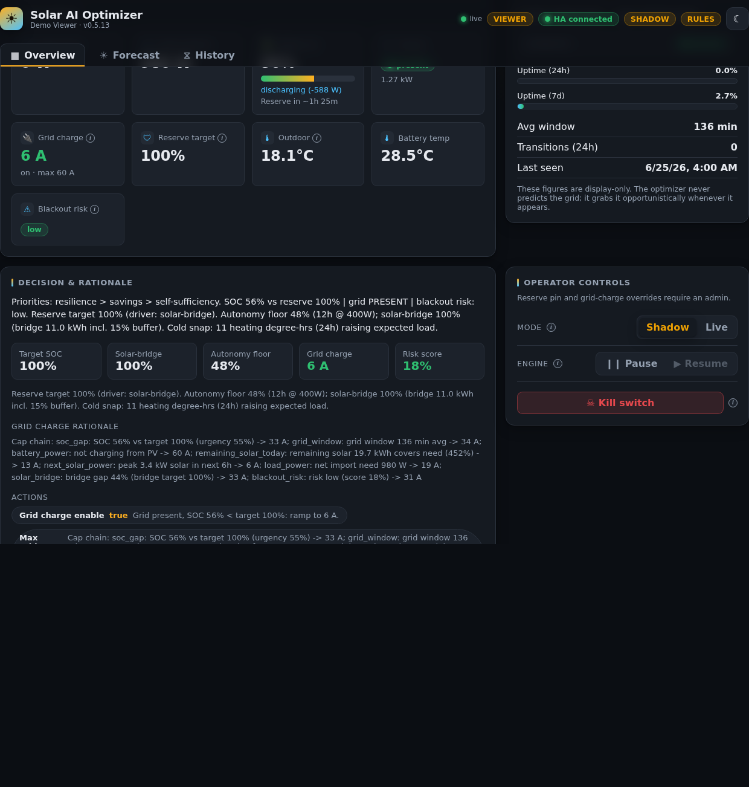
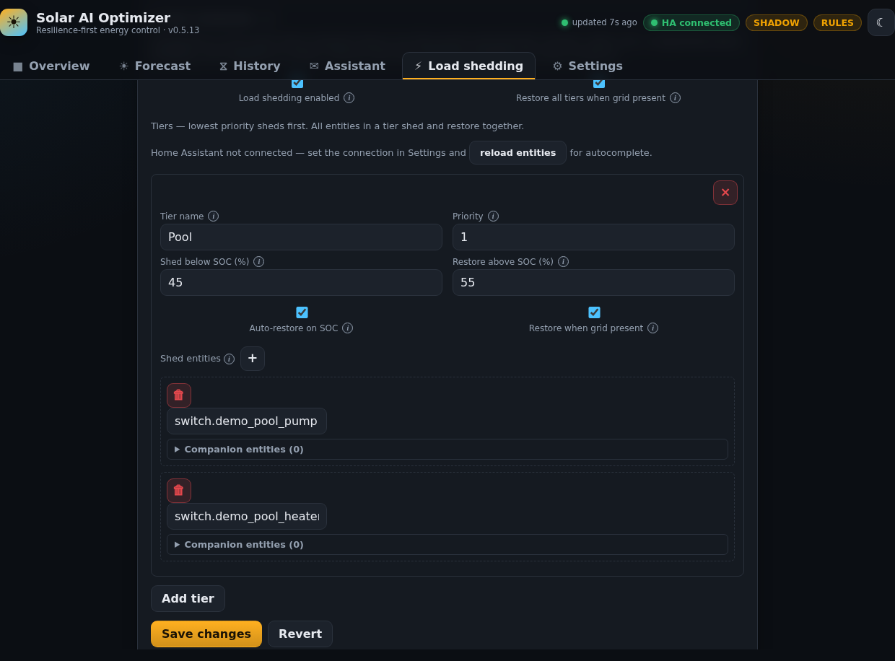

# Solar AI Optimizer — Dashboard User Guide

This guide walks through the Lit web dashboard served with the backend at **http://localhost:8000** (or via the Home Assistant add-on ingress panel). Screenshots use the default **dark** theme at 1280×900 unless noted.

## Getting started

Open the dashboard after [installation](installation.md):

```bash
docker compose up -d --build
```

The top bar shows live connection status and operating mode:

- **HA connected / HA offline** — Home Assistant WebSocket link
- **SHADOW / LIVE** — shadow mode logs actions without writing to the inverter
- **RULES / MPC** — active decision engine (MPC falls back to rules if PuLP is unavailable)
- Status pills such as **SET LOCATION**, **FORECAST DEGRADED**, **STALE DATA**, or **SOLCAST MISCONFIGURED** highlight configuration or data issues (admin only)

Use the **theme toggle** (sun/moon icon) to switch light/dark; charts repaint to match.

### Opening from Home Assistant ingress

When you open Solar AI from the HA sidebar (add-on or hass_ingress), a **boot splash** appears immediately while the app verifies your session (`GET /api/me`). This avoids a blank iframe while JavaScript loads and while ingress role resolution runs. The splash fades out once you are signed in or the login page is shown.

On phones using the **Home Assistant Companion** app, the dashboard respects safe areas (notch, home indicator) and uses larger tap targets. See the [Mobile ingress QA](mobile-ingress-qa.md) checklist when validating layout on iOS or Android.

Production Docker images ship **precompressed** JavaScript, CSS, and HTML (Brotli and gzip sidecars built at image build time). Browsers automatically receive the best format they support — no configuration required. To verify from the host:

```bash
curl -sI -H "Accept-Encoding: br" http://localhost:8000/assets/<chunk>.js
```

Expect `Content-Encoding: br` (or `gzip`) and `Vary: Accept-Encoding`. HA ingress passes these headers through unchanged.

---

## Dashboard roles {#dashboard-roles}

There is **one dashboard** for all users. Roles control which tabs and controls appear — not separate apps or URLs.

| Role | Typical access | Tabs |
|------|----------------|------|
| **Admin** | HA owner, `system-admin` group, local login, or `API_TOKEN` | Overview, Forecast, History, **Assistant**, **Load shedding**, **Settings** |
| **Viewer** | Other HA users via [ingress](ingress-auth.md) | Overview, Forecast, History only |

Role resolution and API enforcement: [Roles and access](ingress-auth.md).

### Feature matrix

| Feature | Admin | Viewer |
|---------|:-----:|:------:|
| Overview live status and decision | Yes | Yes |
| Forecast and history | Yes | Yes |
| Shadow / live toggle | Yes | Yes |
| Pause / resume engine | Yes | Yes |
| Kill switch (with confirmation) | Yes | Yes |
| Reserve pin, grid charge, clear overrides | Yes | No |
| Run control cycle, refresh forecast | Yes | No |
| Assistant (LLM) | Yes | No |
| Settings / config / entities | Yes | No |
| Config status banners (SET LOCATION, etc.) | Yes | Hidden |
| Battery time-to-empty on Overview | Yes | Yes |

---

## Admin dashboard

Admins see all six tabs and the full **Overrides** panel on Overview.


### Overview (admin)

The Overview tab is the control room:

| Area | Purpose |
|------|---------|
| **Overview hero** | Large battery SOC bar with reserve marker and blackout-risk pill |
| **Status cards** | Live PV, load, grid, and related telemetry |
| **Grid statistics** | Recent grid availability stats |
| **Decision & rationale** | Current target reserve, risk score, planned actions, and shed details (expand **Details**) |
| **Overrides** | Shadow/live, pause, kill switch, reserve pin, grid charge, run cycle — grouped by section |

Read the **Decision** panel first: it explains *why* the optimizer chose its current reserve and actions. Use **View shed history** or **Configure shedding** links when shed actions are active.

### Overrides panel (admin) {#overrides-panel-admin}

Admins get the full operator panel:

- **Shadow / Live** — start in shadow; switch to live only after you trust the decisions
- **Pause all** — stop all subsystems (shedding, grid charge, optimization) without losing telemetry
- **Advanced** — pause shedding, grid charge, or optimization independently
- **Kill switch** — emergency stop; grid charge at max (when enabled) and shed tier restore (requires confirmation)
- **Reserve override** — temporarily force a minimum target SOC (%)
- **Force grid charge** — opportunistic grid top-up override (hidden when grid charge is disabled)
- **Run cycle** / **Refresh forecast** — manual triggers
- **Clear overrides** — reset operator overrides after kill switch


### Forecast, History, Assistant, Load shedding, Settings (admin)

Admins use **Forecast** and **History** the same as viewers (see below), plus:

- **Assistant** — LLM chat about recent decisions; optional command apply
- **Load shedding** — tiers, SOC thresholds, companion entity discovery, restore options, and **shed-only deployment** preset (disables grid charge and optimization; optional advisory reserve)
- **Settings** — HA connection, entities, battery, forecast, **engine** / **grid charge** enable toggles, etc.


---

## Viewer dashboard {#viewer-dashboard}

When you sign in through Home Assistant ingress as a non-admin user, the dashboard runs in **viewer** mode:



- **Tabs:** Overview, Forecast, and History only — no Assistant, Load shedding, or Settings
- **Top bar:** **VIEWER** badge; your HA display name may appear under the app title
- **Overview overrides:** **Pause all** / **Resume** and kill switch (with confirmation) only — no per-subsystem Advanced controls, reserve pin, grid charge overrides, or run cycle
- **Read-only banners** on Overview when an admin has pinned reserve SOC or forced grid charge — viewers see the active override but cannot change it
- **Forecast empty state** — if location is not configured, the chart shows a message to ask an admin to set latitude/longitude in Settings (viewers cannot open Settings)
- **Battery time-to-empty** on Overview uses live status data — no Settings access required

Viewers cannot pin reserve SOC, force grid charge, run a control cycle, refresh forecast, clear overrides, use the Assistant, or change configuration.

See [Roles and access](ingress-auth.md) for how admin vs viewer roles are determined.

---

## Overview

Shared by admin and viewer (controls differ — see [Overrides panel (admin)](#overrides-panel-admin) and [Viewer dashboard](#viewer-dashboard)).


---

## Forecast

The **Forecast** tab shows a 48-hour solar and load forecast chart, **Insights** (excess solar, peak load window, reserve runway), and daily energy totals.

- **Solar / Load** series use the left power axis (watts)
- **Temperature** (when configured) uses a separate right-hand °C axis
- Pills warn about **cloudy tomorrow** or a **degraded forecast** (hover for reasons)
- Admins can **Refresh** the forecast manually from this tab

Admins: set site latitude, longitude, PV arrays, and forecast provider under **Settings** if the chart is empty. Viewers: contact an admin if the chart shows a configuration message.


---

## History

History combines telemetry charts and audit tables. Choose a **time window** (6h–7d) and a sub-tab:

| Sub-tab | Contents |
|---------|----------|
| **Timeline** | SOC (%), power (W), optional temperatures, and grid-outage shading |
| **Decisions** | Past decisions with risk and shed action counts |
| **Activity** | Recent inverter writes, shed writes, and grid events (switch segment inside the tab) |


---

## Assistant

**Admin only.** The Assistant answers questions about recent decisions and can apply **parsed commands** when you enable **Allow assistant to apply control commands**.

Examples:

- “Why did you grid-charge?”
- “Set reserve to 60%” (with Apply checked)
- “Engage kill switch confirm” (dangerous — requires explicit confirmation text)

Blocked kill-switch attempts show a red banner explaining the confirmation requirement.

---

## Settings {#settings}

**Admin only.** All runtime configuration is edited here and persisted to the `solar-data` volume. Use **Save changes** after edits.

Major sections:

| Section | What to configure |
|---------|-------------------|
| **Home Assistant connection** | URL, token, SSL verification |
| **Site** | **Timezone** — searchable IANA list or **Auto** (Open-Meteo at site location). **Latitude / longitude** for solar and weather APIs. Applies to forecast daily totals, history/chart timestamps, and backend load/temperature bucketing. |
| **Fail-safe** | Heartbeat entity, shutdown grid-charge-at-max |
| **API security** | Browser-stored API token when `API_TOKEN` is set on the server |
| **Display preferences** | **Language** (English, العربية, Français) and **date format** for this browser: locale default, DD/MM/YY, or YYYY-MM-DD (ISO). Arabic sets right-to-left layout. Applies to history tables, chart axes/cursor, and release dates. Decision rationales, API errors, system-update messages, and assistant heuristic fallbacks follow the selected language when the dashboard sends `X-Solar-Locale` to the backend. Changing language reconnects the live WebSocket and refetches history. Ollama system prompts and heuristic replies are catalog-backed per locale; model output may still vary. History rows stored before the i18n migration may show legacy English skip text until re-fetched; the API normalizes known legacy strings when possible. |
| **Battery / Reserve / Forecast / Control** | Physical and algorithm parameters |
| **PV arrays** | Tilt, azimuth, and kWp per array |
| **Engine** | Rules vs MPC mode; **optimization priority** order (resilience, savings, self-sufficiency) |
| **Temperature** | Heating/cooling load model and outdoor sensor |
| **Inverter entity map** | HA entities for read sensors and write controls |
| **Grid charge** | Ramp settings for grid charging |

Configure **load shedding** in the dedicated **Load shedding** tab (not Settings).

### Adding a dashboard language (contributors) {#adding-a-dashboard-language-contributors}

1. Copy `frontend/src/locales/en.json` to `frontend/src/locales/<id>.json` and translate all string values.
2. Add a `LocaleMeta` entry in `frontend/src/locales/manifest.ts` (`id`, `nativeName`, `dir`, `match` prefixes).
3. Add a loader in `LOCALE_LOADERS` in the same file.
4. Run `docker compose run --rm frontend-test` — the locale parity test fails if keys are missing.

Entity fields support autocomplete when Home Assistant is connected. See [Home Assistant setup](home-assistant-setup.md).

### Engine and optimization priorities

Under **Engine**, choose **Rules** or **MPC**, then reorder **optimization priorities**
(highest first):

1. **Resilience** — larger reserve buffers and stronger blackout-risk response
2. **Savings** — more opportunistic grid charging when the grid is present (not tariff/TOU optimization)
3. **Self-sufficiency** — stronger solar-trim in grid-charge ramp; prefers PV over grid top-up

The summary under the list reflects the active order. Default order matches the
product stance: resilience → savings → self-sufficiency. Priorities scale how
strongly each factor bucket influences the grid-charge cap chain.

### Load-shedding tiers {#load-shedding-tiers}

Open the **Load shedding** tab to configure tiers. Each tier can control **several power
switches** (e.g. pool pump + heater, or an AC power switch). All entities in a tier shed
and restore together using the same SOC hysteresis. Lower **priority** number sheds first.
Tier blocks are **collapsed by default**; the summary line shows the tier name, shed SOC,
priority, and device count — click to expand the full editor.

When you pick a power entity, companions on the same HA device (climate, select, fan, etc.)
are **discovered automatically** and listed under that entity (companion sections also
start collapsed). Remove unwanted companions or
use **Clear all** for switch-only shedding. Devices that were off before shedding stay off on
restore.

Per-tier toggles:

- **Auto-restore on SOC** — restore when SOC rises above the tier threshold
- **Restore when grid present** — restore when grid is detected (if the global flag is on)




**Advanced** sections at the bottom support raw JSON edit, model import/export, and ML retrain.

### Software updates

Under **Software updates** (admin), the dashboard lists recent GitHub releases with
**Markdown-formatted** release notes. On Docker self-update hosts, use **Install** on any
listed stable version. Enable **Include beta releases** to show pre-releases in the table
(installable on self-update hosts); beta versions do not trigger the top-bar **UPDATE**
badge or update toasts. Downgrades show an extra warning; a `/app/data` backup is created
before each install. If the service does not come back after an install, use **Restore**
from the backups section. Use **Check for updates** to refresh the release list. The top
bar **UPDATE** badge appears when a newer **stable** version is available.

Home Assistant add-on installs are updated via Supervisor (the release list is informational).

!!! note "Image version"
    One-click install requires **v0.5.5+** (Docker CLI in the image). v0.5.2–0.5.4 need a
    manual `docker pull` and recreate once — see [Installation](installation.md).

### Toast notifications

Save, login, override, and update actions show brief toast messages at the bottom of
the screen (loading spinner, then success or error). Errors stay visible a few seconds
longer than success messages.

---

## Troubleshooting

| Symptom | What to check |
|---------|----------------|
| **HA offline** | Settings → Home Assistant URL/token; network from container to HA |
| **SET LOCATION** | Forecast latitude/longitude in Settings |
| **SOLCAST MISCONFIGURED** | `SOLCAST_API_KEY` and `SOLCAST_RESOURCE_ID` in environment / add-on options |
| **STALE DATA** | HA entities in inverter map; `ha_stale_after_seconds` in Control |
| **API errors banner** | API token in Settings → API security; CORS if using a separate origin |
| Empty charts | Wait for telemetry history; widen History window |
| **VIEWER** but need Settings | Ask an HA admin or use local admin login for direct access |
| Blank iframe on ingress open | Upgrade to **v0.5.7+** for the boot splash; see [ingress troubleshooting](ingress-auth.md#blank-iframe-or-ha-ui-flashes-inside-the-panel-on-first-load) |
| Double scrollbar in HA app | Fixed in **v0.5.7+** (`background-attachment` and `100vh` layout tweaks); see [Mobile ingress QA](mobile-ingress-qa.md) |

---

## Regenerating screenshots {#regenerating-screenshots}

!!! danger "DEMO_MODE is for docs only"
    Never run `DEMO_MODE` on a system connected to a real inverter.

After UI changes, refresh images for this manual:

```bash
docker compose -f docker-compose.yml -f docker-compose.demo.yml up -d --build
docker compose exec solar python -m scripts.seed_demo
docker compose restart solar
```

Then capture screenshots (Docker — works without local Node/npm):

```bash
# One-time, or after frontend/package-lock.json changes:
docker compose --profile docs run --rm docs-screenshots npm ci

# Every regen (demo stack must be running on port 8000):
docker compose --profile docs run --rm docs-screenshots
```

From `frontend/` you can also run `npm run docs:screenshots:docker`.

Or with local Node installed (one-time `npm ci` + `npx playwright install chromium`):

```bash
cd frontend
npm ci
npx playwright install chromium
npm run docs:screenshots
```

<details><summary>Legacy fallback (slow — reinstalls browsers every run)</summary>

```bash
docker run --rm --add-host=host.docker.internal:host-gateway \
  -v "$(pwd)/frontend:/ui" -v "$(pwd)/docs:/docs" \
  -e SCREENSHOT_BASE_URL=http://host.docker.internal:8000 \
  -w /ui node:24-trixie \
  bash -lc "npm ci && npx playwright install --with-deps chromium && npm run docs:screenshots"
```

On Windows PowerShell, use `c:/Projects/solar/frontend` style paths instead of `$(pwd)`.

</details>

Commit updated files under `docs/images/frontend/` together with any manual text changes. Captures include desktop (1280×900) and mobile (`mobile-*.png`, 390×844) viewports — notably `load-shedding.png`, `settings-load-shedding.png`, and `mobile-load-shedding.png`. The capture script waits for live data, charts, and config to load before each shot (no fixed sleep delays).
