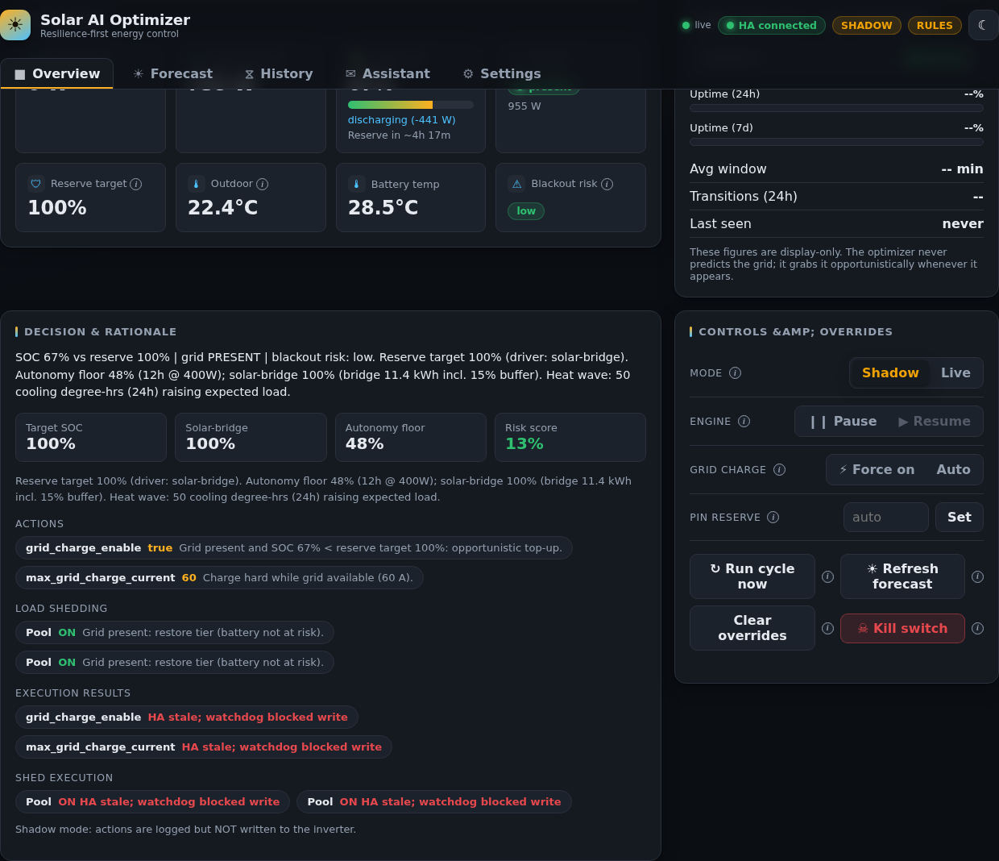
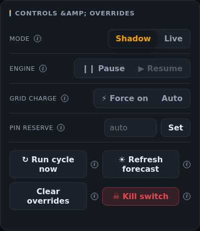
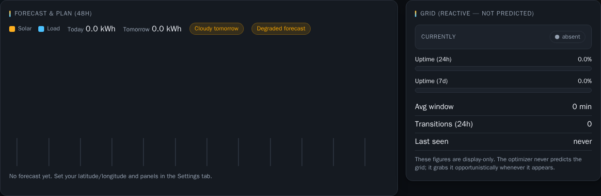
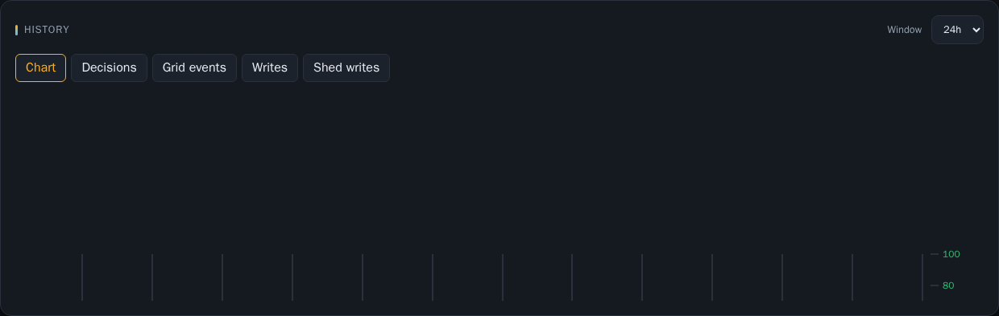
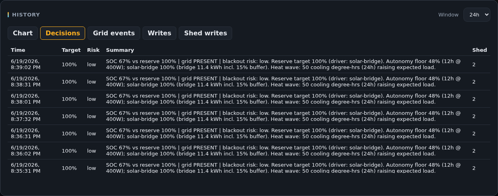
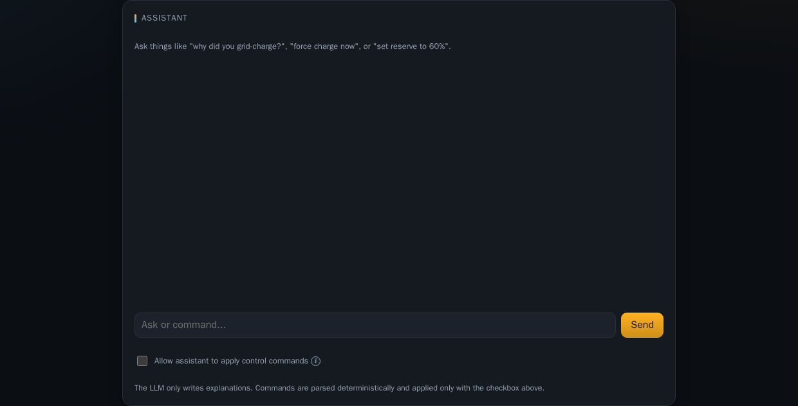
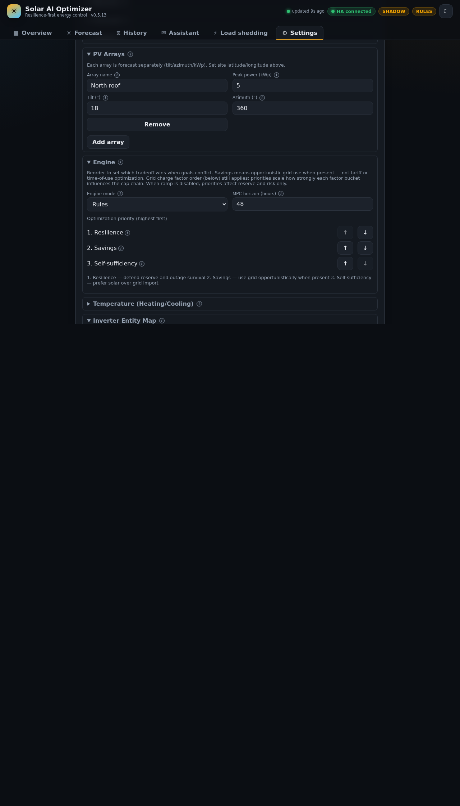
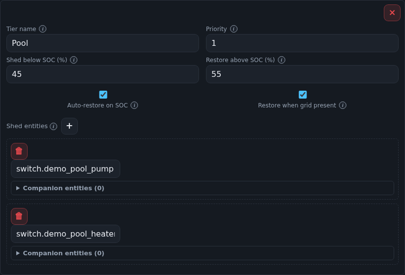

# Solar AI Optimizer — Dashboard User Guide

This guide walks through the Lit web dashboard served with the backend at **http://localhost:8000** (or via the Home Assistant add-on ingress panel). Screenshots use the default **dark** theme at 1280×900.

## Getting started

Open the dashboard in your browser after starting the stack:

```bash
docker compose up -d --build solar
```

The top bar shows live connection status and operating mode:

- **HA connected / HA offline** — Home Assistant WebSocket link
- **SHADOW / LIVE** — shadow mode logs actions without writing to the inverter
- **RULES / MPC** — active decision engine (MPC falls back to rules if PuLP is unavailable)
- Status pills such as **SET LOCATION**, **FORECAST DEGRADED**, **STALE DATA**, or **SOLCAST MISCONFIGURED** highlight configuration or data issues

Use the **theme toggle** (sun/moon icon) to switch light/dark; charts repaint to match.



The main navigation has five tabs: **Overview**, **Forecast**, **History**, **Assistant**, and **Settings**. Your last tab is remembered in the browser.

---

## Overview

The Overview tab is the control room:

| Area | Purpose |
|------|---------|
| **Status cards** | Live SOC, PV, load, grid, and related telemetry |
| **Grid statistics** | Recent grid availability stats |
| **Decision & rationale** | Current target reserve, risk score, and planned inverter actions |
| **Overrides** | Shadow/live toggle, pause, kill switch, manual reserve override |

Read the **Decision** panel first: it explains *why* the optimizer chose its current reserve and actions. The **Overrides** panel on the right is for operator intervention (see below).


### Overrides panel

- **Shadow / Live** — start in shadow; switch to live only after you trust the decisions
- **Pause** — stop the control loop without losing telemetry
- **Kill switch** — emergency stop; restores shed tiers when disengaged (requires confirmation via Assistant or API)
- **Reserve override** — temporarily force a minimum target SOC (%)



---

## Forecast

The **Forecast** tab shows a 48-hour solar and load forecast chart plus daily energy totals.

- **Solar / Load** series use the left power axis (watts)
- **Temperature** (when configured) uses a separate right-hand °C axis
- Pills warn about **cloudy tomorrow** or a **degraded forecast** (hover for reasons)

Set latitude, longitude, PV arrays, and forecast provider under **Settings** if the chart is empty.



---

## History

History combines telemetry charts and audit tables. Choose a **time window** (6h–7d) and a sub-tab:

| Sub-tab | Contents |
|---------|----------|
| **Chart** | SOC (%), power (W), and optional temperatures |
| **Decisions** | Past decisions with risk and shed action counts |
| **Grid events** | Grid present / absent transitions |
| **Writes** | Inverter capability writes (applied, verified, skipped) |
| **Shed writes** | Per-entity load-shedding switch commands |





---

## Assistant

The **Assistant** answers questions about recent decisions and can apply **parsed commands** when you enable **Allow assistant to apply control commands**.

Examples:

- “Why did you grid-charge?”
- “Set reserve to 60%” (with Apply checked)
- “Engage kill switch confirm” (dangerous — requires explicit confirmation text)

Blocked kill-switch attempts show a red banner explaining the confirmation requirement.



---

## Settings

All runtime configuration is edited here and persisted to the `solar-data` volume. Use **Save changes** after edits.

Major sections:

| Section | What to configure |
|---------|-------------------|
| **Home Assistant connection** | URL, token, SSL verification |
| **Fail-safe** | Heartbeat entity, shutdown grid-charge-at-max |
| **API security** | Browser-stored API token when `API_TOKEN` is set on the server |
| **Battery / Reserve / Forecast / Control** | Physical and algorithm parameters |
| **PV arrays** | Tilt, azimuth, and kWp per array |
| **Engine** | Rules vs MPC mode |
| **Temperature** | Heating/cooling load model and outdoor sensor |
| **Inverter entity map** | HA entities for read sensors and write controls |
| **Load shedding** | Tiers with **multiple shed entities** per tier, SOC thresholds, priority |

Entity fields support autocomplete when Home Assistant is connected.



### Load-shedding tiers

Each tier can control **several switches** (e.g. pool pump + heater). All entities in a tier shed and restore together using the same SOC hysteresis. Lower **priority** number sheds first.



**Advanced** sections at the bottom support raw JSON edit, model import/export, and ML retrain.

---

## Troubleshooting

| Symptom | What to check |
|---------|----------------|
| **HA offline** | Settings → Home Assistant URL/token; network from container to HA |
| **SET LOCATION** | Forecast latitude/longitude in Settings |
| **SOLCAST MISCONFIGURED** | `SOLCAST_API_KEY` and `SOLCAST_RESOURCE_ID` in environment / add-on options |
| **STALE DATA** | HA entities in inverter map; `ha_stale_after_seconds` in Control |
| **API errors banner** | API token in Settings → API security; CORS if using a separate origin |
| Empty charts | Wait for telemetry history; widen History window |

---

## Regenerating screenshots

After UI changes, refresh images for this manual:

```bash
docker compose up -d --build solar
cd frontend
npm install
npx playwright install chromium
npm run docs:screenshots
```

Commit updated files under `docs/images/frontend/` together with any manual text changes.
